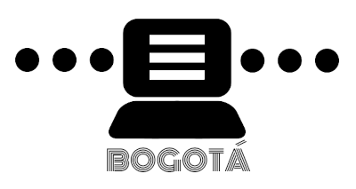
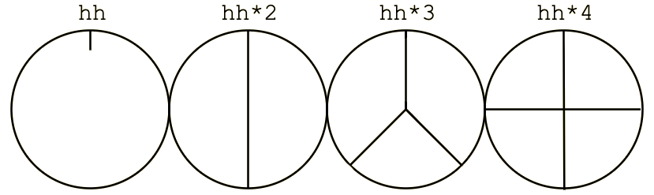

# **Microtaller Live Coding: Introducción a Tidal Cycles**



///////// Bogotá, Colombia<br>
///////// Cinemateca de Bogotá<br>
///////// Rafael Diaz | [@Rafrobeat](https://www.rafrobeat.com) | @TopLapBogota<br>
///////// 2022.05.11 | 2022.05.13<br>
///////// Bienvenidos a TidalCycles<br>
///////// Lenguaje para live coding escrito por Alex Mclean @yaxu<br>
///////// Redes TidalCycles<br>
///////// [Web](https://www.tidalcycles.org)<br>
///////// [Discord](https://discord.com/invite/CqWhZEfNbq)<br>
///////// [Club TidalCycles](https://club.tidalcycles.org)<br>
///////// [Tutorial 4 semanas - Yaxu](https://club.tidalcycles.org/t/weeks-1-4-index/395)<br>
///////// [TOPLAP](https://www.toplap.org)

## Generalidades

### presentación del taller "Introducción a Tidal Cycles"
[Link a la presentación](https://bit.ly/3L2hPcf).

### presentación del taller "Hydra"
[Link a la presentación](https://bit.ly/3yzaK0b).

### comentarios en Tidalcycles

```
-- esto es un comentario
```

### La biblioteca de samples de SUPERDIRT
- Ubica tu carpeta llamada Dirt-Samples (en SuperCollider ve a File y luego selecciona Open User Support Directory)

- Estamos creando patrones con diferentes samples que están localizados en el folder de samples de SuperDirt. Ubica tu folder. Puedes añadir tus propios samples en esa carpeta. Deberás agregarlos en una carpeta nueva en formato .wav y reiniciar supercollider.

### Evalúa las líneas de código
- (Shift+Enter or Ctrl+Enter)

## Parte Básica de TidalCycles

### Ciclos
Tidal Cycles no usa BPM (beats por minuto) sino una medida específica llamada CPS: ciclos por segundo. Para Tidal, el tiempo es cíclico y no lineal. Significa que cuando termina un ciclo, seguirá uno nuevo. El tiempo se cuenta en decrementos cada vez más pequeños de ciclos por segundo (por ejemplo, 1/3 de un ciclo).



### Dividiendo el ciclo

¡Por ahora no le prestemos tanta  atención al código! Ingrese el siguiente patrón en su editor de texto y evalúelo:

```
d1 $ s "bd hh bd hh"
```

Acabamos de dividir un ciclo en cuatro partes iguales, una para cada uno de los sonidos que acabas de activar. Evaluemos esta otra línea:

```
d1 $ s "bd hh hh"
```

Ahora, el ciclo se está dividiendo en tres partes iguales, habrás notado que se desaceleró un poco.

Puede superponer patrones que los dividirá el ciclo en diferentes subdivisiones. Significa que Tidal es una herramienta bastante buena para explorar la polirritmia y las complejidades rítmicas:

```
d1 $ s "bd hh hh"

d2 $ s "hh:2 ~ hh:3 cp"
```
### Patrones

Haces música con Tidal creando patrones. Los patrones siempre se declaran con un nombre específico, d1 ... d9, p "tambor", p 123123, seguido del contenido del patrón. Estos patrones son conexiones para el sintetizador SuperDirt que puede usar para reproducir muestras de audio, sintetizadores, etc. El siguiente ejemplo utiliza cuatro patrones diferentes, separados por una línea en blanco:

```
-- un bombo
d1 $ s "bd ~ bd ~"

-- patrón de HiHat
d2 $s "[~hh]*2"

-- números
d3 $ s "numbers: 1"

-- aplausos
d4 $ s "cp cp cp"
```

### Sintaxis
### Forma básica de crear un sonido (patrones clásicos)

```
d1 $ sound "seawolf"
```

### Otra forma de crear un sonido (patrones por nombre)

```
p "tambor"  $ sound "bassdm:23"
```

### Otra forma de crear un sonido (patrones por número)

```
p 112233  $ sound "latibro"
```

### Varios samples en una misma linea

```
p "tambor" $ sound "bd*4 sd:3*2"
```

```
d1 $ sound "alphabet alphabet:1 alphabet:2 alphabet:3"
```

### Para silenciar evalúa
```
d1 silence
```

```
p "tambor" silence
```

### Para detener todo

```
hush
```

### Podemos tener uno o más "streams o lineas" corriendo al tiempo así:

```
d1 $ sound "sn*3 bd cp"

d2 $ sound "~ ~ h*2"

d3 $ sound "~ cp"

d4 $ sound "newnotes"
```

### Se puede hacer que un stream suene solo:

```
solo 2
```

## -- y desilenciar

```
unsolo 2
```

### --la virgulilla crea un silencio.
```
d3 $ sound "~ sn*4"  
```

### Podemos elegir un sample en específico del folder:
```
d1 $ sound "sn:4 sn:8 sn:10 sn:2"
```

### Todos los samples en un patrón son tocados en un ciclo. Mira cómo se distribuyen:
```
d1 $ sound "bd sn hh:3 cp:2*2 bass:4"

d1 $ sound "bd sn hh cp arpy drum"

d1 $ sound "bd sn hh cp arpy drum bd arpy bass2 feel future"
```

### La velocidad se cambia con la siguiente línea

```
setcps(1)
```

### Traduciendo la velocidad a BPM (Beats Per Minute)

A veces, necesitará convertir entre BPM y CPS (por ejemplo, sincronizando con otro músico o máquina). La función setcps se utiliza para cambiar el número de ciclos por segundo. El número predeterminado de ciclos por segundo es 0,5625.

Estos dos valores son equivalentes:

setcps 0.5625: Ciclos por segundo, como decimal.
setcps (135/60/4): Ciclos por segundo, como fracción.

Representar ciclos por segundo usando fracciones tiene la ventaja de ser más legible por humanos y más alineado con la forma en que el tempo se representa comúnmente en la música como beats por minuto (o bpm). El Techno tiene un rango de 120-140 BPM. El House tiene un rango de 115-130 BPM. Si quisiéramos poner el tempo de nuestra canción de Tidal a house, haríamos lo siguiente:

```
setcps(126/60/4)
```

## Parte Media de TidalCycles

### Podemos anidar un patrón adentro de un paso del ciclo así:
```
d1 $ sound "[numbers:1, ~ numbers:2, numbers:5, [numbers:6,~ ~ ~ diphone*2] numbers:4]" --Los paréntesis cuadrados agrupan.

d1 $ sound " ~ ~ electro1:3"

d2 $ sound " ~ electro1:2*4" #gain 1.3
```
