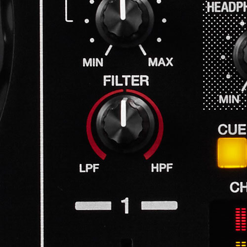

# **Microtaller Live Coding: Introducción a Tidal Cycles**


///////// Bogotá, Colombia<br>
///////// Cinemateca de Bogotá<br>
///////// Rafael Diaz | [@Rafrobeat](https://www.rafrobeat.com) | @TopLapBogota<br>
///////// 2022.05.11 | 2022.05.13<br>
///////// Bienvenidos a TidalCycles<br>
///////// Lenguaje para live coding escrito por Alex Mclean @yaxu<br>
///////// Redes TidalCycles<br>
///////// [Web](https://www.tidalcycles.org)<br>
///////// [Discord](https://discord.com/invite/CqWhZEfNbq)<br>
///////// [Club TidalCycles](https://club.tidalcycles.org)<br>
///////// [Tutorial 4 semanas - Yaxu](https://club.tidalcycles.org/t/weeks-1-4-index/395)<br>
///////// [TOPLAP](https://www.toplap.org)

## Generalidades

### presentación del taller "Introducción a Tidal Cycles"
[Link a la presentación](https://bit.ly/3wKAl3Z).

### presentación del taller "Hydra"
[Link a la presentación](https://bit.ly/3yzaK0b).

### comentarios en Tidalcycles

```
-- esto es un comentario
```

### La biblioteca de samples de SUPERDIRT
- Ubica tu carpeta llamada Dirt-Samples (en SuperCollider ve a File y luego selecciona Open User Support Directory)

- Estamos creando patrones con diferentes samples que están localizados en el folder de samples de SuperDirt. Ubica tu folder. Puedes añadir tus propios samples en esa carpeta. Deberás agregarlos en una carpeta nueva en formato .wav y reiniciar supercollider.

### Evalúa las líneas de código
- (Shift+Enter or Ctrl+Enter)

## Parte Básica de TidalCycles

### Ciclos
Tidal Cycles no usa BPM (beats por minuto) sino una medida específica llamada CPS: ciclos por segundo. Para Tidal, el tiempo es cíclico y no lineal. Significa que cuando termina un ciclo, seguirá uno nuevo. El tiempo se cuenta en decrementos cada vez más pequeños de ciclos por segundo (por ejemplo, 1/3 de un ciclo).


### Dividiendo el ciclo

¡Por ahora no le prestemos tanta  atención al código! Ingrese el siguiente patrón en su editor de texto y evalúelo:

```
d1 $ s "bd hh bd hh"
```

Acabamos de dividir un ciclo en cuatro partes iguales, una para cada uno de los sonidos que acabas de activar. Evaluemos esta otra línea:

```
d1 $ s "bd hh hh"
```

Ahora, el ciclo se está dividiendo en tres partes iguales, habrás notado que se desaceleró un poco.

Puede superponer patrones que los dividirá el ciclo en diferentes subdivisiones. Significa que Tidal es una herramienta bastante buena para explorar la polirritmia y las complejidades rítmicas:

```
d1 $ s "bd hh hh"

d2 $ s "hh:2 ~ hh:3 cp"
```
### Patrones

Haces música con Tidal creando patrones. Los patrones siempre se declaran con un nombre específico, d1 ... d9, p "tambor", p 123123, seguido del contenido del patrón. Estos patrones son conexiones para el sintetizador SuperDirt que puede usar para reproducir muestras de audio, sintetizadores, etc. El siguiente ejemplo utiliza cuatro patrones diferentes, separados por una línea en blanco:

```
-- un bombo
d1 $ s "bd ~ bd ~"

-- patrón de HiHat
d2 $s "[~hh]*2"

-- números
d3 $ s "numbers: 1"

-- aplausos
d4 $ s "cp cp cp"
```

### Sintaxis
### Forma básica de crear un sonido (patrones clásicos)

```
d1 $ sound "seawolf"
```

### Otra forma de crear un sonido (patrones por nombre)

```
p "tambor"  $ sound "bassdm:23"
```

### Otra forma de crear un sonido (patrones por número)

```
p 112233  $ sound "latibro"
```

### Varios samples en una misma linea

```
p "tambor" $ sound "bd*4 sd:3*2"
```

```
d1 $ sound "alphabet alphabet:1 alphabet:2 alphabet:3"
```

### Para silenciar evalúa
```
d1 silence
```

```
p "tambor" silence
```

### Para detener todo

```
hush
```

### Podemos tener uno o más "streams o lineas" corriendo al tiempo así:

```
d1 $ sound "sn*3 bd cp"

d2 $ sound "~ ~ h*2"

d3 $ sound "~ cp"

d4 $ sound "newnotes"
```

### Se puede hacer que un stream suene solo:

```
solo 2
```

### -- y desilenciar

```
unsolo 2
```
## Comodines

### -- La virgüililla crea un silencio.

```
d1 $ sound "~ sn*4"  
```

### -- El signo ! crea una replica del sample.

```
d1 $ s "bd!3 sd"
```

Esto es equivalente a

```
d1 $ s "bd bd bd sd"
```

### -- El signo * crea una repetición del sample.
```
d1 $ s "bd*2 sd"
```

Esto es equivalente a

```
d1 $ s "[bd bd] sd"
```

### -- El signo / ralentiza el sample.
```
d1 $ s "bd/2"
```

Esto es equivalente a

```
d1 $ s (slow 2 $ "bd")
```

Podemos multiplicar y dividir grupos también:
```
d1 $ sound "[alphabet:2 numbers:1]/4 cp"
```

* Aquí vemos la aparición de la función slow. Más adelante la usaremos.

### -- Casi olvido el más importante (para mi): Si quieres que algo pase 'a veces', puedes poner un interrogante ( ? ) .
```
d1 $ sound "sn*2 bd cp? hh"
```

### Podemos elegir un sample en específico del folder:
```
d1 $ sound "sn:4 sn:8 sn:10 sn:2"
```

### Todos los samples en un patrón son tocados en un ciclo. Mira cómo se distribuyen:
```
d1 $ sound "bd sn hh:3 cp:2*2 bass:4"

d1 $ sound "bd sn hh cp arpy drum"

d1 $ sound "bd sn hh cp arpy drum bd arpy bass2 feel future"
```

### La velocidad se cambia con la siguiente línea

```
setcps(1)
```

### Traduciendo la velocidad a BPM (Beats Per Minute)

A veces, necesitará convertir entre BPM y CPS (por ejemplo, sincronizando con otro músico o máquina). La función setcps se utiliza para cambiar el número de ciclos por segundo. El número predeterminado de ciclos por segundo es 0,5625.

Estos dos valores son equivalentes:

setcps 0.5625: Ciclos por segundo, como decimal.
setcps (135/60/4): Ciclos por segundo, como fracción.

Representar ciclos por segundo usando fracciones tiene la ventaja de ser más legible por humanos y más alineado con la forma en que el tempo se representa comúnmente en la música como beats por minuto (o bpm). El Techno tiene un rango de 120-140 BPM. El House tiene un rango de 115-130 BPM. Si quisiéramos poner el tempo de nuestra canción de Tidal a house, haríamos lo siguiente:

```
setcps(126/60/4)
```

## Parte Media de TidalCycles

### Podemos anidar un patrón adentro de un paso del ciclo así:
```
d1 $ sound "[numbers:1, ~ numbers:2, numbers:5, [numbers:6,~ ~ ~ diphone*2] numbers:4]"

d1 $ sound " ~ ~ electro1:3"

d2 $ sound " ~ electro1:2*4" #gain 1.3
```

- Los paréntesis cuadrados o corchetes, agrupan.
- El signo de coma ","  se usa para crear poliritmos.

```
d1 $ sound "[bd, amencutup] bd"

d2 $ sound "[hh hh, arpy arpy:1 arpy:2]"
```
Así podemos comenzar a crear complejidad desde la simplicidad:
```
d1 $ sound "arpy arpy:1 arpy:3 arpy:4"

d2 $ sound "[arpy arpy:1, arpy:3*4 arpy:8 arpy:7*3 arpy:4, arpy:5 arpy:6]"
```

Y usar tantas capas como queramos:
```
d1 $ sound "[hh sn, sn cp sn, arpy:4 arpy:, ~ cp]"
```

### Mezclando comas y paréntesis cuadrados:
```
d1 $ sound "[hh, [sn*2] cp/2 notes*5, arpy:6 arpy:2, arpy [arpy:4 [arpy:1 arpy:2] arpy:3 arpy], odx, ~ cp]"
```

## STACK (pilas)
Con stack podemos agrupar varios patrones en un sólo stream:

```
d1 $ sound "newnotes*2 newnotes:5*3"

d2 $ sound "jvbass"

d3 $ sound "808*2"
```
- El stack con con los patrones anteriores

```
p "miStack" $ stack [
    sound "newnotes*2 newnotes:5*3 ! newnotes:4"
    # speed "2",
    sometimes (striate 5) $ sound "jvbass*4",
    sometimes brak $ sound "808*2",
     sound "metal*2",
     sound "bd"]
    # gain "1"
    # vowel "o"
```

## Efectos (Funciones de efectos)


- Podemos aplicar efectos para cambiar el sonido, o el cómo suena, por ejemplo los filtros formantes tipo vocales:
```
d1 $ sound "can:1" # vowel "a"
```

- Estos son algunos de los efectos más usados.

|    Nombre 	    |                       Descripción
| accelerate	    | patrón de números que acelera o frena los samples mientras se ejecutan.
| begin	          | patrón de números de 0 a 1, Salta el principio de cada sample, por ejemplo, 0.25 corta el primer cuarto de cada sample.
| coarse          | 	seudo-remuestreo, un patrón de números para bajar el muestreo, por ejemplo, 1 es original, 2 la mitad, 3 la tercera parte.
| crush	          | bit crushing, patrón de números de 1 a 16, con 1 reduciendo el bit depth al máximo y 16 dejándolo igual.
| cutoff	        | patrón de números de 0 a 1, establece la frecuencia de corte de un LPF.
| delay	          | patrón de números de 0 a 1, establece en nivel del delay.
| delayfeedback	  | patrón de números de 0 a 1, establece la cantidad de feedback del delay. También se usa como delayfb
| delaytime       | patrón de números de 0 a 1, establece el largo del delay. También se usa como delayt
| end	            | igual a begin, pero aplica al final de cada sample acortándolo.
| gain            |	patrón de números para especificar el volumen, valores inferiores a 1 lo hacen mas suave, valores superiores a 1 lo hacen mas fuerte.
| pan	            | patrón de números de 0 a 1, panea de izquierda a derecha (si hay estéreo).
| resonance / lpq | 	patrón de números de 0 a 1, establece la resonancia de un LPF.
| shape           | distorsión de onda, 0 no distorsiona, 1 para máxima distorsión.
| speed	          | patrón de números de 0 a 1, cambian la velocidad del sample, también es una forma económica de cambiar la altura del sample.
| vowel	          | filtro para hacer que los samples suenen como vocales, el patrón puede tener cualquier vocal, use (~) para que no tenga efecto.
| lpf / cutoff    | filtro pasabajos. Le damos la frecuencia de corte en Hertz. Entre 0 y 10000 apróx.
| hpf / hcutoff   | filtro pasaaltos. Le damos la frecuencia de corte en Hertz. Entre 0 y 1000 apróx.
| djf             | filtro dj. Le damos la frecuencia de corte entre 0 y 1.
| orbit           | filtro dj. Le damos la frecuencia de corte entre 0 y 1.

- [Lista completa de filtros](http://tidalcycles.org/docs/patternlib/tutorials/audio_effects/)


- Algunos ejemplos

### Gain
```
d1 $ sound "jvbass*4"
    # gain "1.3"
```

### DJF (filter dj)
```
d1 $ sound "jvbass*4"
    # gain "1.3"
    # djf "0.2"
```

### LPF (low pass fitler)
```
d1 $ sound "jvbass*4"
    # gain "1.3"
    # lpf "200"
```

### HPF (high pass filter)
```
d1 $ sound "jvbass*4"
   # hpf "2000"
   # gain 1.3
 ```

## Parte avanzada de TidalCycles
### Bjorklund (y Euclides)
- Si pone dos números en paréntesis luego de un elemento en un patrón, entonces Tidal distribuirá el primer número de sonidos equitativamente a lo largo del segundo número de pasos:
```
d1 $ sound "jvbass:2(3,8)"
```

- Pero, como no es posible distribuir tres elementos a lo largo de 8 pasos discretos, el algoritmo hace lo mejor que puede. El resultado es un campaneo, pruebe este:
```
d1 $ sound "can(5,8)"
```

Estos código usan el "Algoritmo Bjorklund", el cual no fue hecho para la música sino en aplicaciones para física nuclear, lo que es bastante emocionante. Mas emocionante aún es que este algoritmo es muy similar estructuralmente a uno de los primeros algoritmos conocidos, escrito en el Libro de los elementos de Euclides en el 300 AC. Puede leer mas sobre esto en el paper The Euclidean Algorithm Generates Traditional Musical Rhythms por Toussaint. Ejemplos de este paper se incluyen acá, aunque algunos requieren rotación sobre un pulso particular, lea el paper para ver los detalles y las referencias.

| Patrón  |                     	Descripción
| (2,5)	  | Ritmo persa del siglo trece llamado Khafit-e-ramal.
| (3,4)	  | El patrón básico de la Cumbia Colombiana, al igual que del Calypso de Trinidad.
| (3,5)	  | Si se inicia en el segundo pulso, es otro ritmo persa al igual que un ritmo popular de baile de Rumania.
| (3,7)	  | Ritmo Ruchenitza usado en la música popular bailable de Bulgaria.
| (3,8)	  | Patrón de tresillo cubano.
| (4,7)	  | Otro ritmo Ruchenitza usado en la música popular bailable de Bulgaria.
| (4,9)   | Aksak, ritmo Turco.
| (4,11)  | Patrón usado por Frank Zappa en su tema titulado Outside Now.
| (5,6)	  | Produce el patrón York-Samai, un ritmo árabe popular, si se empieza en el segundo beat.
| (5,7)	  | Patrón Nawakhat, otro popular ritmo árabe.
| (5,8)	  | Patrón de cinquillo cubano.
| (5,9)	  | Un ritmo popular en Arabia llamado Agsag-Samai.
| (5,11)  | Patrón métrico usado por Moussorgsky en Cuadros de una exposición.
| (5,12)  | Patrón de palmas sudafricano llamado Venda, de canciones infantiles.
| (5,16)  | Patrón circular del Bossa-Nova Brasilero.
| (7,8)	  | Ritmo que se toca sobre el Bendir.
| (7,12)  | Patrón del occidente africano.
| (7,16)  | Patrón circular de la Samba Brasilera.
| (9,16)  | Ritmo circular usado en la República de África central.
| (11,24) | Ritmo circular de los Pigmeos Aka en África central.
| (13,24) |	Otro ritmo circular de los Pigmeos Aka de Sangha.

### Funciones
Hasta ahora hemos trabajado casi exclusivamente en construir secuencias, aunque se han incluido poliritmos, y manipulaciones algorítmicas simples que estan incluídas dentro de la sintáxis de Tidal. Es momento de ascender en el nivel de abstracción y ver que encontramos en el camino.

Primero miremos de cerca las funciones que hemos usado hasta ahora.

## **d1** es una función que toma un patrón como entrada para luego enviarla a dirt. Por defecto hay 16 de estos definidos, de d1 a d16, lo que permite empezar y parar patrones múltiples al tiempo.

## Signo de dolar $
Se preguntarán que hace el signo de dolar $. Si no se lo a preguntado, puede saltarse esta sección.

El signo de dolar no hace casi nada; simplemete toma todo lo que esté a su derecha y se lo envía a la función a su izquierda.

## cat y slowcat | Pegar patrones


### Synthes
