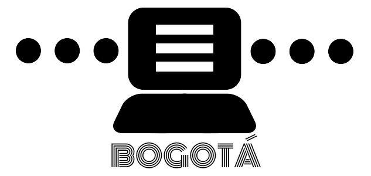

# **Microtaller Live Coding: Introducción a Tidal Cycles**



///////// Bogotá, Colombia<br>
///////// Cinemateca de Bogotá<br>
///////// Rafael Diaz | [@Rafrobeat](https://www.rafrobeat.com) | @TopLapBogota<br>
///////// 2022.05.11 | 2022.05.13<br>
///////// Bienvenidos a TidalCycles<br>
///////// Lenguaje para live coding escrito por Alex Mclean @yaxu<br>
///////// Redes TidalCycles<br>
///////// [Web](https://www.tidalcycles.org)<br>
///////// [Discord](https://discord.com/invite/CqWhZEfNbq)<br>
///////// [Club TidalCycles](https://club.tidalcycles.org)<br>
///////// [Tutorial 4 semanas - Yaxu](https://club.tidalcycles.org/t/weeks-1-4-index/395)<br>
///////// [TOPLAP](https://www.toplap.org)

## Generalidades

### presentación del taller
[Link a la presentación](https://bit.ly/3L2hPcf).

### comentarios en tidalcycles

```
-- esto es un comentario
```

### La biblioteca de samples de SUPERDIRT
- Ubica tu carpeta llamada Dirt-Samples (en SuperCollider ve a File y luego selecciona Open User Support Directory)

- Estamos creando patrones con diferentes samples que están localizados en el folder de samples de SuperDirt. Ubica tu folder. Puedes añadir tus propios samples en esa carpeta. Deberás agregarlos en una carpeta nueva en formato .wav y reiniciar supercollider.

### Evalúa las líneas de código
- (Shift+Enter or Ctrl+Enter)

## Básico

### Forma básica de crear un sonido

```
d1 $ sound "seawolf"
```

### Otra forma de crear un sonido
```
p "tambor"  $ sound "bassdm:23"
```

### Varios samples en una misma linea

```
p "tambor" $ sound "bd*4 sd:3*2"
```

```
d1 $ sound "alphabet alphabet:1 alphabet:2 alphabet:3"
```

### Para silenciar evalúa
```
d1 silence
```

```
p "tambor" silence
```

### Para detener todo

```
hush
```

### --Podemos tener uno o más "streams o lineas" corriendo al tiempo así:

```
d1 $ sound "sn*3 bd cp"

d2 $ sound "~ ~ h*2"

d3 $ sound "~ sn*4"  --la virgulilla crea un silencio.

d4 $ sound "~ cp"

d5 $ sound "newnotes"
```

### Se puede hacer que un stream suene solo:

```
solo 2
```

-- y desilenciar

```
unsolo 2
```

### Podemos elegir un sample en específico del folder:
```
d1 $ sound "sn:4 sn:8 sn:10 sn:2"
```

### Todos los samples en un patrón son tocados en un ciclo. Mira cómo se distribuyen:
```
d1 $ sound "bd sn hh:3 cp:2*2 bass:4"
```
